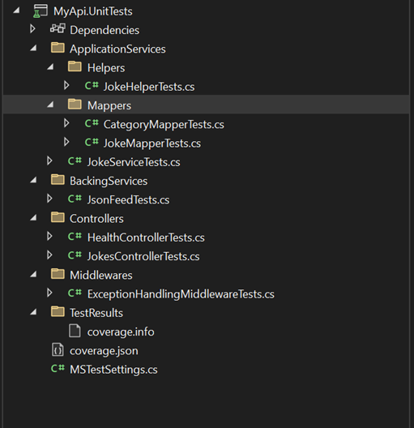
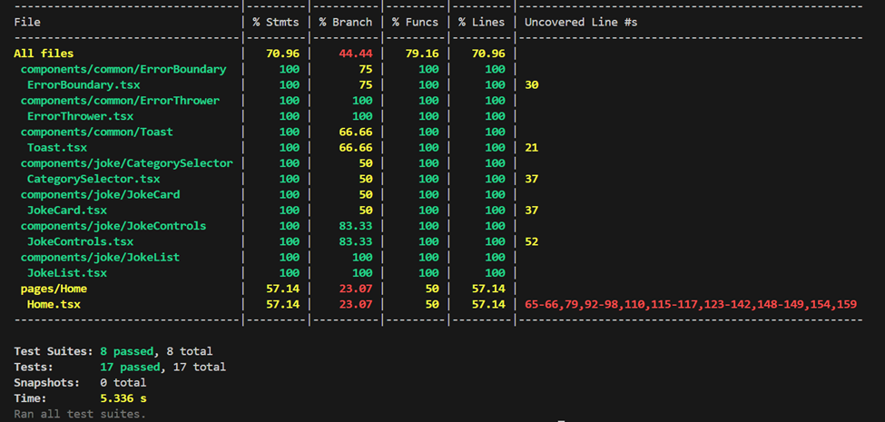

# Geotab Application Documentation

## Table of Contents

- [How to Run the Application](#how-to-run-the-application)
- [Testing](#testing)
- [Building and Debugging](#building-and-debugging)
- [Changes](#changes)
  - [Backend](#backend)
  - [Frontend](#frontend)
- [Demo](#demo)
- [Scope for Improvements](#scope-for-improvements)

## How to Run the Application

This will run the application in production mode.

### Prerequisites

Make sure that ports 3000, 5277, and 7151 are free. You may need to kill processes running on these ports by using:

```
netstat -ano | findstr :5277
taskkill /PID <PID from last column> /F
```

### Running with Docker Compose

```
docker-compose up
```

### Running Individual Containers

For frontend:

```
cd .\my-app\
docker build -t my-app .
docker run -d -p 3000:80 my-app
```

For backend:

```
cd .\MyApi\
docker build -t my-api .
docker run -d -p 5277:5277 my-api:latest
```

Access the application at: http://localhost:3000

## Testing

### Backend Testing

**Unit Tests**:

```
cd .\MyApi\MyApi.Tests\
dotnet test
```

**Integration Tests**:

```
cd .\MyApi\MyApi.IntegrationTests\
dotnet test
```

### Frontend Testing

```
cd .\my-app\
npm install
npm test
```

## Building and Debugging

### Backend

```
cd .\MyApi\MyApi\
dotnet run
```

### Frontend

```
cd .\my-app\
npm install
npm start
```

## Changes

I completely rewrote the code based on best practices, making the system more robust, maintainable, and scalable. Following are the changes:

### Backend

#### SOLID Principles

I implemented all SOLID principles throughout the codebase:

1. **Single Responsibility Principle**: All class declarations within the API are responsible for a single, well-defined task.

   

2. **Open/Closed Principle**: I used an Exception Handler Middleware to demonstrate this principle. This means that existing classes are closed for modification but open for extension.

3. **Liskov Substitution Principle**: We can easily switch between different implementations of interfaces within the application without impacting other parts. For example, the IJsonFeed interface implementations.

4. **Interface Segregation Principle**: No "fat" interfaces exist within the application. All interfaces have been decoupled to inject only what is needed for each class.

5. **Dependency Injection**: .NET 8.0 comes with a built-in dependency injector. I injected different services in the Program.cs file:

   

#### Layered Architecture

I organized the code using a layered architecture approach, with a clean folder structure:


#### Environment Configurations

I created two application settings files:

- `appsettings.json` (Production)
- `appsettings.Development.json` (Development)

These configurations allow for leveraging different environment deployments.

**Development Environment**:

- Includes debug-level error logging
- Allows connections from all hosts
- Configures backing service calls (ApiEndpoints) and retry limits (maxRetries)


**Production Environment**:

- Includes all development features plus more sophisticated features like rate limiting


We can switch between environments by updating the `ASPNETCORE_ENVIRONMENT` in `properties/launchsettings.json`:


The Program.cs file bootstraps the application and its services based on the chosen environment:


#### Testing

**Unit Tests**:
Created a separate package for unit testing different portions of the application using MSTest:



**Integration Tests**:
Implemented an integration testing suite that tests multiple API components. It does NOT hit the backing service (JSON feed). Instead, I created mocks for the JSON feed methods `GetCategoriesAsync` and `GetRandomJokesAsync`:


#### Exception Handling

Included a global exception handling middleware that makes it easy to log exceptions at a single point. This avoids writing multiple try-catch blocks within the API, which would violate code reusability principles:


#### Documentation

**XML Comments**:
Added XML comments for all methods and classes to make it easier for teammates to work with the codebase:


**Swagger Documentation**:
Leveraged XML comments to generate Swagger documentation, which establishes and explains the API contract for frontend developers:


### Frontend

#### Refactoring Approach

I restructured this joke generator application to follow modern React best practices while maintaining clean, maintainable code.

#### Architecture Decisions

##### Folder Structure

I organized the application with a domain-based folder structure for better separation of concerns:

- **components/** - UI components divided by domain
- **hooks/** - Custom React hooks for shared functionality
- **pages/** - Full page components
- **router/** - Centralized routing configuration
- **services/** - API integration layer
- **types/** - TypeScript interfaces
- **utils/** - Helper functions

  

#### Error Handling Strategy

I implemented comprehensive error handling to enhance application reliability:

1. **React Error Boundary** - Captures rendering errors to prevent application crashes
2. **API Health Verification** - Proactively checks API availability on startup
3. **Dedicated Error Routes** - Created specific routes for different error scenarios:
   - `/error` - Displays when API is unavailable or encounters a fatal error
   - `/rate-limit` - Shows when the user exceeds API request limits
4. **Toast Notifications** - Non-intrusive feedback for recoverable errors

## Testing Approach

I created corresponding test files for each component and service in the application. Each test file follows the component's name (e.g., `JokeCard.test.tsx` for the `JokeCard.tsx` component), ensuring complete test coverage and making future maintenance more straightforward.

#### Best Practices Applied

- **Component Composition** - Breaking UI into logical, reusable components
- **TypeScript Integration** - Strong typing for improved code quality and developer experience (/types/index.ts)
- **Conditional Rendering** - Appropriate UI based on application state (loads jokes based on the user input)
- **Material UI Implementation** - Consistent design system application
- **Environment Configuration** - Flexible setup for different deployment environments (.env with local default environment variables when debugged in local and Dockerfile for production deployment)
- **Clean Code Principles** - Meaningful naming, clear commenting, and consistent structure
- **Custom API Hook (hooks/useApi)** - Centralizes API state management and error handling with appropriate routing
- **API Service Layer (serives/api.ts)** - Configures Axios instance with common settings and provides endpoint-specific functions

#### Improvements

- Enhanced layout
- Added dropdown functionality
- Implemented error handling
- Added functionality to get a specified number of jokes
- Added Jest test cases

#### Security

- Implemented CORS protection
- Added rate limiting

## Demo

### Application Load

The application loads with a clean interface displaying the jokes data:


### Failure Cases

1. **Service Retry Failure**: The system attempts to call the backing services up to 5000 times to load data. It returns a failed state if it's unable to load:

   

2. **Rate Limiting**: Only 10 requests per minute are allowed as protection against DOS attacks. When the limit is exceeded, an error page is displayed:

   

## Scope for Improvements

- **Distributed Logging**: For the interview, I kept logging as console logs in both frontend and backend. In a production environment, I would implement a distributed logging solution for multiple deployments.

- **Distributed Rate Limiter**: I would implement Redis Cache for more advanced rate limiting capabilities.

- **Unit Test Coverage**: Due to time constraints, I only managed to achieve partial code coverage in the test suite:

  
  
